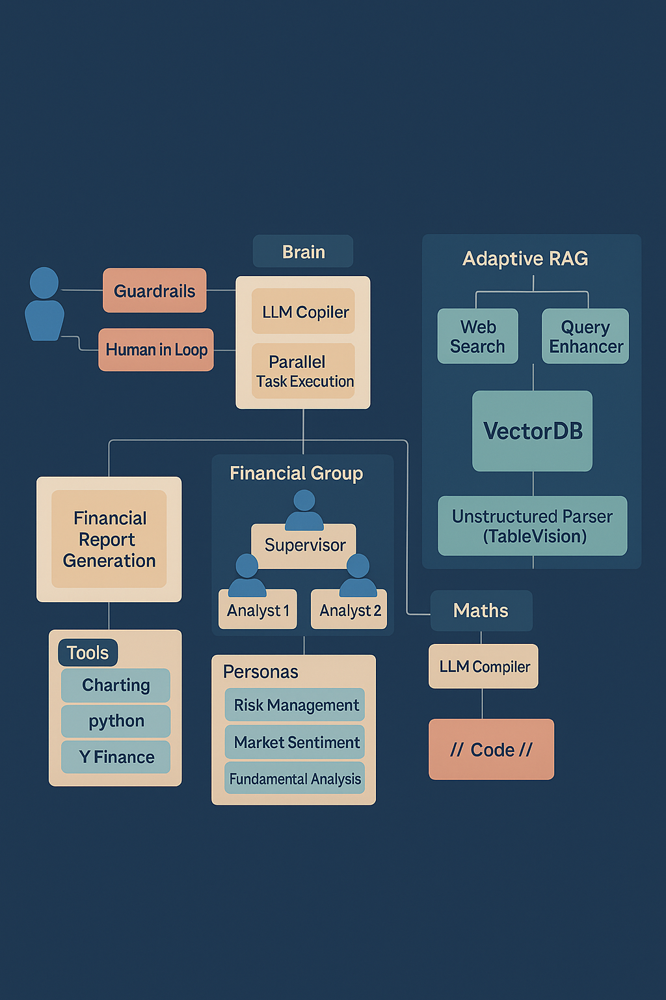

# 🚀 CLARUS — Collaborative LLM Agents for Reliable Understanding in Finance


**Project CLARUS** is a Multi-Agent Retrieval-Augmented Generation (MARAG) system focused on financial Q\&A and automated financial report generation. It combines a Supervisor (LLM Compiler-inspired), Adaptive RAG retrieval (with TableVision), a multi-agent Financial Analyst group, a Math/Code executor, and a Report Generation tool — all with Human-in-the-Loop (HITL) and Responsible-AI guardrails.

---

## 📑 Table of Contents

* [📌 Overview](#-overview)
* [✨ Key Features](#-key-features)
* [🧩 Architecture & Workflow](#-architecture--workflow)

  * [📊 Diagram](#-diagram)
  * [🔄 Walkthrough (step-by-step)](#-walkthrough-step-by-step)
* [📂 Repository Layout](#-repository-layout)
* [⚡ Quickstart](#-quickstart)
* [▶️ Run Examples](#️-run-examples)
* [📈 Report Generation](#-report-generation)
* [🛡️ Responsible AI & Guardrails](#️-responsible-ai--guardrails)
* [🔐 Security Notes](#-security-notes)
* [🔮 Future Work](#-future-work)

---

## 📌 Overview

CLARUS is designed to answer complex financial queries and produce professional, data-driven reports by combining retrieval, reasoning, and generation. It improves retrieval for tricky data formats (especially tables) with a custom **TableVision** mode and uses dynamic planning, parallel task execution, and minimal human intervention to boost accuracy and reduce hallucination.

---

## ✨ Key Features

* 🔍 Adaptive RAG that routes queries to indexed data or web search depending on need.
* 📊 **TableVision**: enriched table extraction and markdown table indexing for better retrieval.
* 👥 **Financial Analyst Group**: multi-agent discussion (lead + analysts) with dynamic personas (fundamental, sentiment, risk).
* ➗ **Math/Code Tool**: translates NL math queries into code and executes in parallel where applicable.
* 🧠 **Supervisor**: LLM-Compiler-inspired planner that builds a DAG of tasks, supports replanning, and integrates HITL nodes.
* 📑 **Report Generation**: fetch historical stock data, produce metrics & charts, compile Word/PDF reports.
* 💻 **UI**: realtime pipeline sync, execution DAG visualiser, and replayable conversations.

---

## 🧩 Architecture & Workflow

### 📊 Diagram



> workflow architecture

### 🔄 Walkthrough (step-by-step)

1. **User → Guardrails** 🧱

   * Guardrails filter unsafe requests and reconstruct when possible.

2. **Supervisor (Brain)** 🧠

   * Breaks query into a DAG of subtasks, supports replanning, and integrates HITL checkpoints.

3. **Adaptive RAG Module** 🔍

   * Router decides between Pathway index or Web Search.
   * Query Enhancer builds multiple rephrasings for better recall.
   * Pathway Vector Store + TableVision handle enriched table retrieval.
   * Grader reranks results; retries or falls back if needed.

4. **Financial Analyst Group** 👥

   * Multi-agent group (Lead + Analysts) with personas (Fundamental, Risk, Sentiment).
   * Collaborative reasoning improves depth and reliability.

5. **Math Tool** ➗

   * Converts natural language math → code, executes in parallel, returns metrics or plots.

6. **Report Generation** 📑

   * Compiles charts, insights, and evidence into Word/PDF reports.

7. **UI & Replay** 💻

   * Shows outputs, DAG execution graph, and replay of conversations.

---

## 📂 Repository Layout

```
Project-CLARUS/
├── __pycache__/
├── server/                  # backend / pipeline orchestration
├── .env.example             # environment variables template
├── .gitignore
├── LLMCompiler.ipynb        # notebook demonstrating supervisor/LLM-compiler experiments
├── README.md                # project documentation
├── requirements.txt         # dependencies
├── test.md                  # test notes
```

---

## ⚡ Quickstart

**Prerequisites**

* 🐍 Python 3.9+
* 🌐 Node.js (optional, if using a frontend)
* 🔑 API keys (OpenAI / Pathway / Firebase)

**Install**

```bash
git clone https://github.com/Vaibhav-30-12/Project-CLARUS.git
cd Project-CLARUS
python -m venv .venv
source .venv/bin/activate   # macOS/Linux
.venv/Scripts/Activate.ps1  # Windows
pip install -r requirements.txt
```

**Environment**

```bash
OPENAI_API_KEY=your-openai-key-here
LANGCHAIN_API_KEY=your-langchain-key-here
LANGSMITH_API_KEY=your-langsmith-key-here
TAVILY_API_KEY=your-tavily-key-here
groq_api_key=your-groq-key-here
```

---

## ▶️ Run Examples

```bash
# If entrypoint is server/app.py
cd server
python app.py

# OR with Flask app factory
export FLASK_APP=server.app
flask run
```

---

## 📈 Report Generation

* 📉 Pulls data using `yfinance`.
* 📊 Analyzes with `pandas`.
* 🖼️ Visualizes with `matplotlib`.
* 📑 Formats professional Word/PDF reports with `python-docx`.

---

## 🛡️ Responsible AI & Guardrails

* 🚫 Filters unsafe inputs.
* ✅ Reconstructs queries safely.
* 🔎 Cross-validates retrieved facts.
* 🙋 HITL: allows user clarifications at checkpoints.

---

## 🔐 Security Notes

* ❌ Don’t commit secrets.
* ✔️ Use `.env.example` for sharing config.

---

## 🔮 Future Work

* 🧾 Specialized agents (Tax, ESG, Compliance).
* 📊 Broader FinanceBench evaluations.
* 📺 Enhanced UI dashboards.

---
